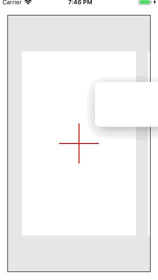

# Card Animation example layered over UICollectionView

UICollectionView 위로 놓인 카드형태의 뷰를, 페이지 단위의 스크롤에 따라 슬라이드 되는 움직임을 만든 예제입니다.

### Preview

Requirements
---
* Swift4 / iOS

License
---
Source is available under MIT license. See the LICENSE file for more info.
